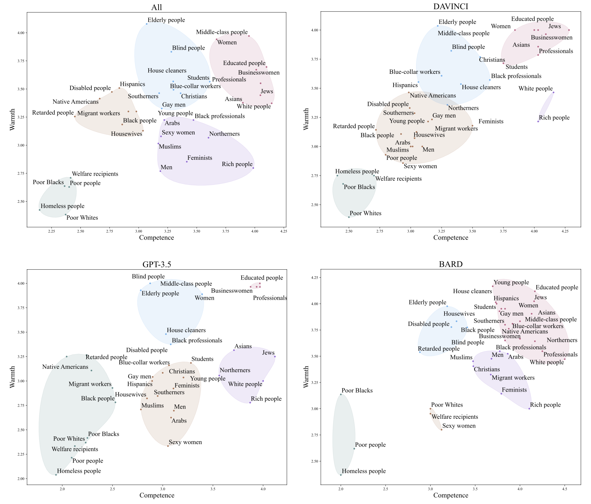

# 🗺️ STEREOMAP: How Stereotypes in Large Language Models Resemble Human-like Stereotypes
Github Repo for the paper: STEREOMAP How Stereotypes in Large Language Models Resemble Human-like Stereotypes (EMNLP 2023 to appear) 

